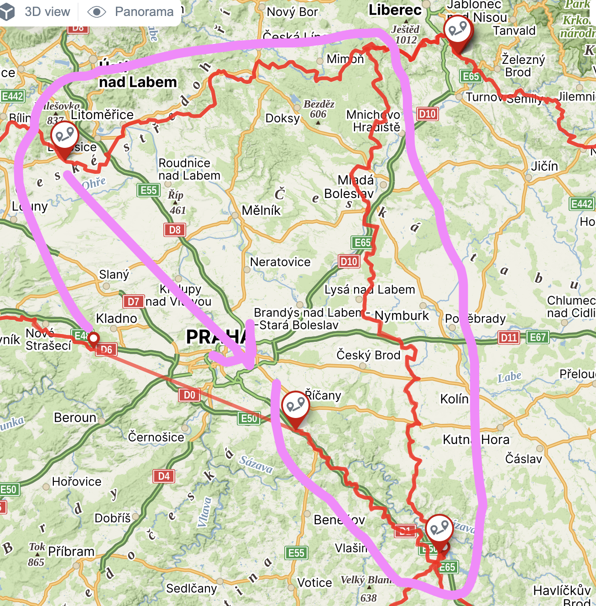

## Куда

- Поедем кусок трассы Trans Czech Trail
- Подробнее о трессе https://motosvet.cz/testy/894-tct.html
- Как это выгладит можно посмотреть на видео тут https://www.youtube.com/results?search_query=Trans+Czech+Trail
## Когда
- пятница до обеда.
- воскресенье вечер в праге
## Кто
- Ростик/Стас/Миша/Саша??
## Что должен взять
- собственные вещи
	- must have
		- палатка
		- спальник
		- корематка
		- спец ботинки - must have
		- дождевик
		- остальные вещи (термо и тд)
	- nice to have
		- черепаха
		- защита колен
- общие вещи
	- must have
		- навигация (желательно у каждого свой держатель для телефона)
		- горелка (у Вани?)
		- инструменты
		- питание (каждый сам)
	- nice to have
		- рация

## Полезные ссылки 
- Подробнее о трессе Trans Czech Trail https://motosvet.cz/testy/894-tct.html
- Карты в навигацию https://motosvet.cz/testy/894-tct.html?showall=&start=1